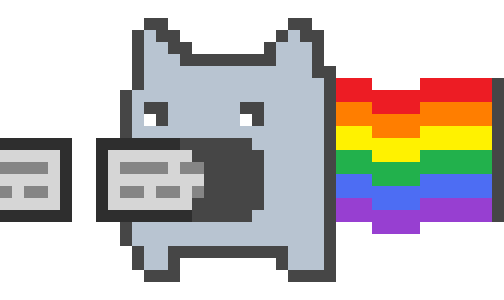

# TokenLoom - The ultimate token streams parser

<h1 align="center">
<br/>

<br/>
</h1>

TokenLoom is a TypeScript library for progressively parsing streamed text (LLM/SSE-like) into structured events. It detects:

- Custom tags like `<think>...</think>` (non-nested in v1)
- Fenced code blocks (``` or ~~~), including language info strings
- Plain text emitted as tokens/words/graphemes

## Why TokenLoom?

**The Problem:** When working with streaming text from LLMs, SSE endpoints, or real-time data sources, you often need to parse structured content that arrives in arbitrary chunks. Traditional parsers fail because they expect complete, well-formed input. You might receive fragments like:

- `"<thi"` + `"nk>reasoning</think>"` (tag split across chunks)
- ` "```java" ` + ` "script\nconsole.log('hello');\n```" ` (code fence fragmented)
- Incomplete sequences that need buffering without blocking the stream

**Existing Solutions Fall Short:**

- **DOM parsers** require complete markup and fail on fragments
- **Markdown parsers** expect full documents and don't handle streaming
- **Regex-based approaches** struggle with boundary conditions and backtracking
- **Custom state machines** are complex to implement correctly for edge cases

**TokenLoom's Solution:**

- **Stream-native design** that handles arbitrary chunk boundaries gracefully
- **Progressive emission** - start processing immediately, don't wait for completion
- **Intelligent buffering** with configurable limits to prevent memory issues
- **Robust boundary detection** that works even when tags/fences split mid-sequence
- **Plugin architecture** for flexible post-processing and output formatting

Perfect for AI applications, real-time chat systems, streaming markdown processors, and any scenario where structured text arrives incrementally.

**Design intent:**

- Tolerate arbitrary chunk fragmentation (e.g., `<thi` + `nk>` or ````+`javascript\n`)
- Emit start → progressive chunks → end; do not stall waiting for closers
- Bound buffers with a high-water mark; flush when needed

### Key features

- **Streaming-safe detection** of custom tags and code fences
- **Incremental emission**: does not block waiting for closers; emits start, progressive chunks, then end
- **Configurable segmentation**: token, word, or grapheme units
- **Plugin system**: pluggable post-processing via simple event hooks
- **Backpressure-friendly**: exposes high-water marks and flushing

### Status

- v1 supports custom tags and fenced code blocks; Markdown headings and nested structures are intentionally out-of-scope for now.

## Installation

```bash
npm install tokenloom
```

For development:

```bash
npm ci
npm run build
```

**Requirements:** Node 18+

## Quick start

````ts
import { TokenLoom, LoggerPlugin } from "tokenloom";

const parser = new TokenLoom({
  tags: ["think", "plan"], // tags to recognize
});

parser.use(new LoggerPlugin((msg) => console.log(msg)));

const input = `Intro\n\n<think>hidden</think>\n\n\`\`\`javascript\nconsole.log("Hello");\n\`\`\``;

// Simulate streaming chunks
for (const chunk of [
  "Intro\n\n<thi",
  "nk>hid",
  "den</t",
  "hink>\n\n```java",
  "script\nconsole.log(",
  '"Hello");\n```',
]) {
  parser.feed({ text: chunk });
}

parser.flush();
````

The logger plugin prints events like text, tag-open/close, code-fence-start/chunk/end, and flush.

## API overview

### Construction

```ts
new TokenLoom(opts?: ParserOptions)
```

```ts
type EmitUnit = "token" | "word" | "grapheme";

interface ParserOptions {
  emitUnit?: EmitUnit; // default "token"
  bufferLength?: number; // maximum buffered characters before attempting flush (default 2048)
  tags?: string[]; // tags to recognize e.g., ["think", "plan"]
  /**
   * Maximum number of characters to wait (from the start of a special sequence)
   * for it to complete (e.g., '>' for a tag open or a newline after a fence
   * opener). If exceeded, the partial special is treated as plain text and
   * emitted. Defaults to bufferLength when not provided.
   */
  specBufferLength?: number;
  /**
   * Minimum buffered characters to accumulate before attempting to parse a
   * special sequence (tags or fences). This helps avoid boundary issues when
   * very small chunks arrive (e.g., 1–3 chars). Defaults to 10.
   */
  specMinParseLength?: number;
}
```

### Core methods

- `use(plugin: IPlugin): this` – registers a plugin
- `remove(plugin: IPlugin): this` – removes a plugin
- `feed(chunk: SourceChunk): void` – push-mode; feed streamed text
- `flush(): void` – force flush remaining buffered content and emit `flush`
- `dispose(): void` – cleanup resources and dispose all plugins
- `[Symbol.asyncIterator](): AsyncIterator<Event>` – pull-mode consumption

### Events

````ts
type SourceChunk = { text: string };

type FenceMarker = "```" | "~~~";

type Event =
  | { type: "text"; text: string; in?: Context }
  | {
      type: "tag-open";
      name: string;
      attrs: Record<string, string>;
      in?: Context;
    }
  | { type: "tag-close"; name: string; in?: Context }
  | {
      type: "code-fence-start";
      fence: FenceMarker;
      lang?: string;
      in?: Context;
    }
  | { type: "code-fence-chunk"; text: string; in?: Context }
  | { type: "code-fence-end"; in?: Context }
  | { type: "flush" }
  | { type: "error"; reason: string; recoverable: boolean };

type Context = {
  inTag?: { name: string; attrs: Record<string, string> } | null;
  inCodeFence?: { fence: FenceMarker; lang?: string } | null;
};
````

### Plugins

```ts
interface IPlugin {
  name: string;
  onInit?(api: IPluginAPI): void | Promise<void>;
  onEvent?(e: Event, api: IPluginAPI): void | Promise<void>;
  onDispose?(): void | Promise<void>;
}

interface IPluginAPI {
  pushOutput(s: string): void;
  state: Readonly<Context>;
}

// Base class for creating plugins
abstract class Plugin implements IPlugin {
  abstract name: string;
  onInit?(api: IPluginAPI): void | Promise<void>;
  onEvent?(e: Event, api: IPluginAPI): void | Promise<void>;
  onDispose?(): void | Promise<void>;
}
```

**Built-in plugins:**

- `LoggerPlugin(log?: (msg: string) => void)` – logs human-readable events
- `TextCollectorPlugin()` – collects text and code fence chunks into a buffer
- `LoggerPlugin` – class-based logger plugin
- `TextCollectorPlugin` – class-based text collector plugin

## Usage patterns

### Push mode (typical for SSE/LLM streaming)

````ts
const parser = new TokenLoom({
  tags: ["think"],
  emitUnit: "token",
  bufferLength: 64,
});
parser.use(new LoggerPlugin((msg) => console.log(msg)));

function* randomChunks(str: string) {
  let i = 0;
  while (i < str.length) {
    const n = 3 + Math.floor(Math.random() * 4); // 3-6 characters
    yield str.slice(i, i + n);
    i += n;
  }
}

const text =
  "<think>Hello</think>\n\n```javascript\nconsole.log('Hello world');\n```";
for (const chunk of randomChunks(text)) {
  parser.feed({ text: chunk });
}

parser.flush();
````

### Pull mode (AsyncIterator)

```ts
const parser = new TokenLoom({ tags: ["plan"] });

async function processAsync() {
  // Start async processing
  const processingPromise = (async () => {
    for await (const event of parser) {
      console.log(`Event: ${event.type}`);
      if (event.type === "flush") break;
    }
  })();

  // Feed data with delays to simulate streaming
  const chunks = ["<plan>Step 1: ", "Parse input\n", "Step 2: Process</plan>"];
  for (const chunk of chunks) {
    parser.feed({ text: chunk });
    await new Promise((resolve) => setTimeout(resolve, 100));
  }

  parser.flush();
  await processingPromise;
}

processAsync();
```

## Examples

You can run the examples after building the project:

```bash
# Build first
npm run build

# Basic parsing with plugins
node examples/basic-parsing.js

# Streaming simulation with random chunking and event tracing
node examples/streaming-simulation.js

# Async processing demo
node examples/async-processing.js

# Custom plugin example
node examples/custom-plugin.js
```

## Development

### Scripts

```bash
npm ci                  # install
npm run build           # build with rollup
npm run dev             # watch build
npm test                # run tests (vitest)
npm run test:run        # run tests once
npm run test:coverage   # coverage report
```

### Repo layout

- `src/` – library source
  - `types.ts` – core types and interfaces
  - `segment.ts` – segmentation utilities (Intl.Segmenter fallback)
  - `events.ts` – plugin event bus
  - `tokenloom.ts` – public API wrapper
  - `index.ts` – library exports
  - `plugins.ts` – plugin factory functions
  - `parser/` – streaming parser implementation
    - `parser.class.ts` – main streaming parser
    - `base-handler.ts` – base handler class
    - `text-handler.ts` – text mode handler
    - `tag-handler.ts` – tag parsing handler
    - `fence-handler.ts` – code fence handler
    - `types.ts` – parser internal types
    - `utils.ts` – parser utilities
  - `plugins/` – built-in plugin classes
    - `plugin.class.ts` – base plugin class
    - `logger.plugin.ts` – logger plugin
    - `textCollector.plugin.ts` – text collector plugin
- `tests/` – Vitest tests
- `examples/` – runnable examples

## Architecture & Design

### Core Architecture

TokenLoom uses a **handler-based architecture** where different parsing modes are handled by specialized classes:

- **TextHandler**: Processes plain text and detects special sequence starts
- **TagHandler**: Handles content inside custom tags
- **FenceHandler**: Processes code fence content

The parser maintains internal state and switches between handlers based on the current parsing mode.

### Design Constraints

- **No nesting (v1)**: Custom tags and code fences are not nested in this version
- **Boundary robustness**: Tolerates arbitrary chunk fragmentation (e.g., `<thi` + `nk>` or ````+`javascript\n`)
- **Progressive emission**: Emits events immediately without waiting for complete structures
- **Buffer management**: Uses configurable buffer limits with intelligent flushing

### Segmentation

- **Token**: Splits by whitespace vs non-whitespace runs
- **Word**: Uses `Intl.Segmenter` when available, falls back to simple heuristics
- **Grapheme**: Uses `Intl.Segmenter` when available, falls back to code point iteration (prevents surrogate pair splitting)

### Fence Detection

- Supports both ``` and ~~~ fences
- Allows up to 3 leading spaces for indented fences
- Captures language info strings after fence openers
- Handles fragmented fence sequences robustly

## Roadmap

- Optional nested tag/block support
- Markdown structures (headings, lists, etc.)
- More robust Unicode segmentation and locale controls
- Additional built-in plugins (terminal colorizer, markdown renderer)

## License

MIT
